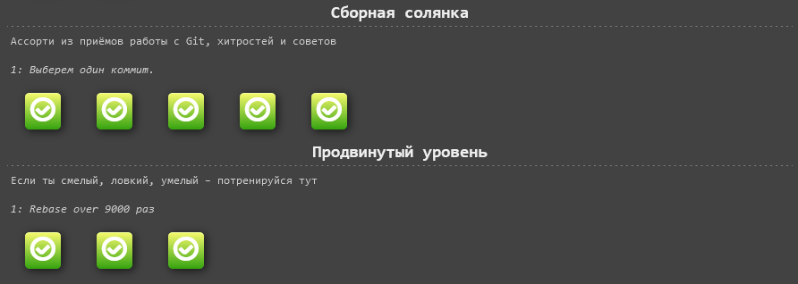
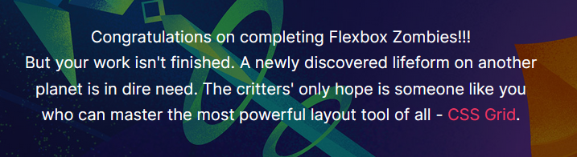

# kottans-frontend

The repository for the "Kottans" front-end course :smiley_cat:

The information below will be my reflections on the studied material according to the given format:
https://github.com/kottans/frontend

### Git Basics:

**Main:**

- [x] [Udacity "Version Control with Git"](https://www.udacity.com/course/version-control-with-git--ud123):

* The "Relative Commit References" vere completely new to me.
* I was surprised Git is not used exclusively by developers.
* I will be using more flags to be able to display information in different ways.

- [x] [Learngitbranching](https://learngitbranching.js.org)
  1. Main: Introduction Sequence
  2. Remote: Push & Pull -- Git Remotes

* I saw git branching in graphical representation.
* Git branching is an amazing feature that gives the room for experiments without any harm.
* I will be using it in my future projects.

- [x] Send a pull-request to Kottans/mock-repo proposing a change.

* While doing this task I got authentification problem after trying to do `git --set-upstream origin`. That's how I've found out about personal access tokens :grimacing:

**Extra Materials:**

- [x] [Git за 30 хвилин](https://codeguida.com/post/453)

* This article helped to recap the basic knowledge in my native language.

- [x] [Git tips](https://www.webfx.com/blog/web-design/git-tips/)

* A good article with the bunch of additional resources which can be used in a future.

- [x] [About Merge Conflicts](https://docs.github.com/en/github/collaborating-with-pull-requests/addressing-merge-conflicts/about-merge-conflicts) and [Resoilving a Merge Conflict](https://docs.github.com/en/github/collaborating-with-pull-requests/addressing-merge-conflicts/resolving-a-merge-conflict-using-the-command-line)

* I've learned how to resolve different types of conflicts and installed GitHub Desktop.

- [x] [The GitHub Training Team "Communicating using Markdown"](https://lab.github.com/githubtraining/communicating-using-markdown)

* I didn't know there was such thing called "Markdown" even though I used some of it's syntax.
* The thing that has surprised me was that you can even create tables with it.
* I am already using it, at least lists and emojis.

- [x] [Learn anything front-end](https://learn-anything.xyz/web-development/front-end)

* I've taken a look at the resourse and kept it for the future reference.

- [x] [TypingClub](https://www.typingclub.com)

* Before I didn't know I type slow and incorrectly :open_mouth:
* I've never mentioned the two little bumps on the "home row".
* I've incorporated every day typing practice in my daily routine.

- [x] [Как учиться и справляться с негативными мыслями](https://guides.hexlet.io/learning/)

* I was familiar with the concept of the "fixed and growth mindsets" but it was nice to refresh it in memory.
* I am using the methodology from the article to track negative thoughts and overcome them.

### Linux CLI, and HTTP:

**Main:**

- [x] [Linux Survival](https://linuxsurvival.com/linux-tutorial-introduction/)
      
      
      
      

* Security chapter was brand new to me. It was very interesting to decypher the terminal output and change permissions to the different types of users.
* The thing that has surprised me was the list of processes I have on my computer which gave me a bit of paranoia :worried:
* I will definitely use everything I've learned apart from the printer related commands (for now) as I don't have any.

- [x] [HTTP: The Protocol Every Web Developer Must Know - Part 1](https://code.tutsplus.com/tutorials/http-the-protocol-every-web-developer-must-know-part-1--net-31177)

* I didn't know most of the terms, except of the "status codes".
* It was surprising to find out the "request" and "response" has much more data then I thought.
* For now I don't know how I can incorporate since I don't understand how can I use it.

- [x] [HTTP: The Protocol Every Web Developer Must Know - Part 2](https://code.tutsplus.com/tutorials/http-the-protocol-every-web-developer-must-know-part-2--net-31155)

* I've finally understood the difference between "http" and "https".
* The way cache works was more complex.
* It's useful to know what is going "under the hood".

**Extra Materials:**

- [x] [Основы командной строки Hexlet](https://ru.hexlet.io/courses/cli-basics)
      

* I have never used Vim before.
* "Streams" and the way of redirecting them was surprising to me (I didn't knew about STDIN, STDOUT and STDERR).
* I got more in-depth understanding of how \*nix systems work and how to interact with them, which I am already applying.

- [x] [How I Taught Myself to Code in Eight Weeks](https://lifehacker.com/how-i-taught-myself-to-code-in-eight-weeks-511615189)

* Before this article I had no idea of the whole structure of the web application.
* It was surprising that you can create a working prototype (including backend) just in 8 weekends.
* I will return back to the resources mentioned in the article and try to do my own prototype (hopefully) in 8 weekends too :neckbeard:

- [x] [How JavaScript works: Deep dive into WebSockets and HTTP/2 with SSE + how to pick the right path](https://blog.sessionstack.com/how-javascript-works-deep-dive-into-websockets-and-http-2-with-sse-how-to-pick-the-right-path-584e6b8e3bf7)

* Now I have an idea what WebSockets are and that there is HTTP/2 that in combination with SSE can be used as its more secure replacement (not in all cases though).

**Optional:**

- [x] [Wes Bos "Command Line Power User"](https://commandlinepoweruser.com)

* I already had -zsh but I wasn't aware of it's possibilities, like adding the plugins.
* Suprising was that with the simple instructions I still got errors and spent extra time to google them in order to be able to set up "oh my zsh", "z" and "trash".
* I will definitely use `trash` instead of `rm` to avoid accidental irreversible delitions.

### Git for Team Collaboration

**Main:**

- [x] [Udacity "GitHub & Collaboration"](https://classroom.udacity.com/courses/ud456)

* I didn't know about "squashing" commits.
* it was surprising to me that it is possible to contribute to an open sourse project even if you are a beginner, - there is always an issue for any level.
* I will try to contribute in an open sourse project.
  
  
  

- [x] [Learngitbranching](https://learngitbranching.js.org)
  1. Main: Ramping Up, Moving Work Around
  2. Main: A Mixed Bag, Advanced Topics
  3. Remote: To Origin and Beyond

* How git commands actually work on branches was new to me, thanks to the graphical representation.
* I didn't knew I can push, pull and fetch from one branch to another or even create new ones on the flight.
* I will feel more comfortable using git knowing a bit more of it's advanced features.

**Optional:**

- [x] [An Introduction to Git and GitHub by Brian Yu (CS50 course)](https://www.youtube.com/watch?v=MJUJ4wbFm_A)

* Nothing new or surprising, just a brief recap of the learned material.

- [x] [Oh Shit, Git!?!](https://ohshitgit.com/)

* A whole bunch of new git commands.
* Is there this kind of situations you want to delete everything? :bomb:
* I will use these solutions when I will get into this sorts of situations.

- [x] [Flight rules for Git](https://github.com/k88hudson/git-flight-rules)

* A complete troubleshooting manual. Saved for the upcoming problems in the future :suspect:

### Intro to HTML and CSS

**Main:**

- [x] [Udacity "Intro to HTML & CSS"](https://www.udacity.com/course/intro-to-html-and-css--ud001)

* Good basics, nothing new.
* I will continue to use dev tools and using MDN and CSS tricks as a reference.

- [x] [Codeacademy "Learn HTML"](https://www.codecademy.com/courses/learn-html/lessons/intro-to-html/exercises/intro)

* I have learned HTML before, nothing new or surprising, a good recap.
* I will be using semantic HTML.

- [x] [Codeacademy "Learn CSS"](https://www.codecademy.com/courses/learn-css/lessons/learn-css-setup-and-syntax/exercises/intro-to-css)

* New things were: `overflow` property is set to parent container, `visibility: hidden;` hides the element, but reserves it's space, unlike `display: none;`.
* I didn't know about the `sticky` property.
* Now I know how to add the `@font-face` which I will use.

**Optional:**

- [x] [GitHub Learning Lab "Introduction to HTML"](https://lab.github.com/githubtraining/introduction-to-html)

* Nothing new, especially after all the previous materials

- [x] Build a Tribute Page [Tribute Page](https://github.com/SeggyFault/tribute-page)
- [x] Build a Survey Form [Survey Form](https://github.com/SeggyFault/survey-form)
- [x] Build a Technical Documentation Page [Technical Documentation Page](https://github.com/SeggyFault/technical-documentation-page)

* Custom CSS Variables and `:root`

- [x] ["Can't Unsee"](https://cantunsee.space/)

* It was fun to remember good old times when I have worked as a designer.
* Surprisingly I haven't nailed all of the challenges.
* I need to be more attentive to the letter spacing.

- [x] [Hexlet "Основы HTML, CSS и веб-дизайна"](https://ru.hexlet.io/courses/html)

* Hexlet practice was very useful in order to understand the material.

### Responsive Web Design

**Main:**

- [Udacity "Responsive Web Design"](https://www.udacity.com/course/responsive-web-design-fundamentals--ud893) WIP 80%

- [x] [Flexbox Froggy](http://flexboxfroggy.com/)

* It was cool to see a graphical representation of the flexbox properties in action, I haven't used `align-content` before
* Nothing surprising, I used flexbox before
* For now I want to see the difference with the CSS grid to understand which one to use in which cases

**Optional:**

- [x] [Grid Garden](http://cssgridgarden.com/)

* I didn't know I can use negative values for `grid-column-start` and `grid-column-end`
* Level 26 was surprisingly complicated and I needed to google for the hints
* I will use CSS Grid as a primary instrument for creating layouts

- [x] [Flexbox Zombies](https://flexboxzombies.com/p/flexbox-zombies)

* Amazing learning tool and just flipping awesome game! Helped me to remember flexbox properties, now
  everytime I am using flexbox I imagine where my crossbox is pointing :dart:

- [x] [Specificity Calculator](https://specificity.keegan.st/)
- [x] [Specificity](https://developer.mozilla.org/uk/docs/Web/CSS/Specificity)

* Useful resources to consult with, saved for later. For understanding specificity I prefer [Specifishity](https://specifishity.com/) :fish:

- [x] [A simple explanation of High DPI screens](https://broken-links.com/2013/10/02/simple-explanation-high-dpi-screens/)

* I've finally understood what is the "device-independent pixel" (DIP) and "physical pixel density" (in Retina for 1 DIP there are double of physical pixels, 2 horizontal and 2 vertical)

- [x] [11 вещей которые я узнал, читая спецификацию flexbox](https://habr.com/ru/post/329820/)

* Very usfull article from the first till the last word. Maybe except of the `position: static;` :lemon:
* Alignments with the margin was surprising
* I can't wait to use this flexbox magic in the projects :sparkles:

### JavaScript Basics

- [x] [Udacity "Intro to JS"](https://classroom.udacity.com/courses/ud803)

* Finally find out what does "hoisting" means
* Functions are surprisingly the hardest part to understand so far
* .splice() is my must have for the future

- [FreeCodeCamp "Basic JavaScript"](https://www.freecodecamp.org/learn/javascript-algorithms-and-data-structures/#basic-javascript) WIP 108/111
- [FreeCodeCamp "ES6"](https://www.freecodecamp.org/learn/javascript-algorithms-and-data-structures#es6) WIP 8/31

- [x] [FreeCodeCamp "Basic Data Structures"](https://www.freecodecamp.org/learn/javascript-algorithms-and-data-structures#basic-data-structures)

### Document Object Model

**Main:**

- [x] [Udacity "JavaScript and the DOM"](https://classroom.udacity.com/courses/ud117)

* Find out what is "Bubbling"
* How the JS handles the asynchroneous functions
* I will use the things I have learned in practice

**Optional:**

- [x] [JavaScript DOM Crash Course by Brad Traversy](https://www.youtube.com/watch?v=0ik6X4DJKCc&list=PLillGF-RfqbYE6Ik_EuXA2iZFcE082B3s)

* The practical example finally showed how everything works together
* I will use the knowlegde from this crash course on implementing interactive side-menu site, hopefully :sweat_smile:

